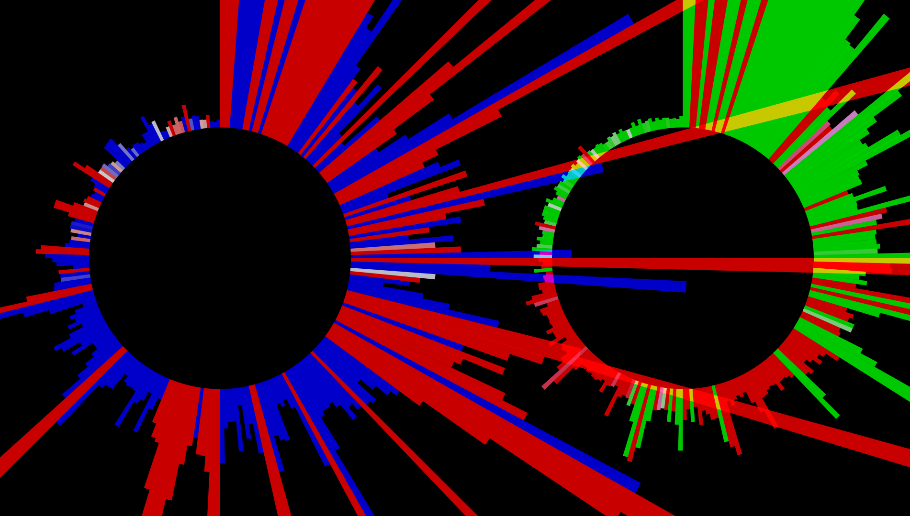
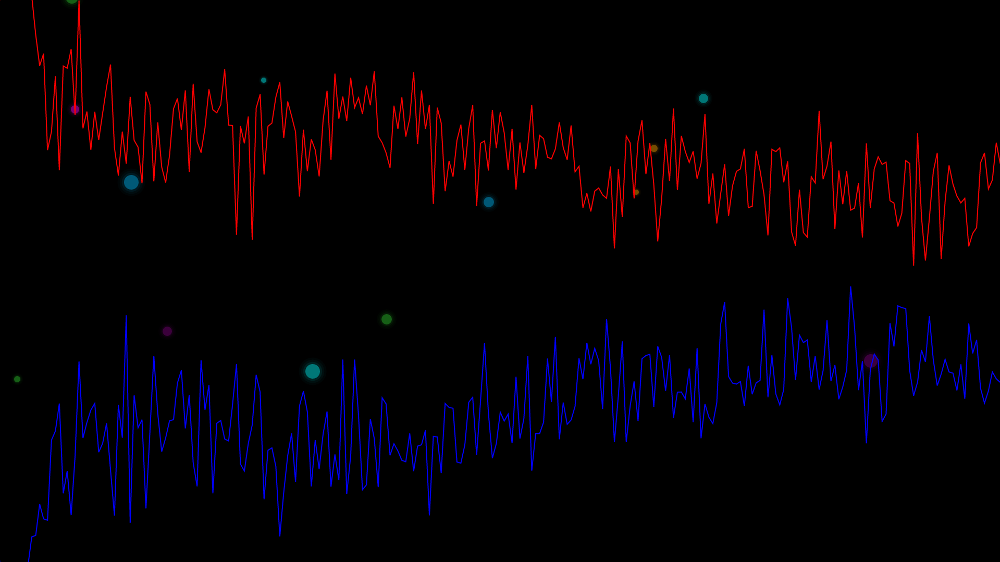
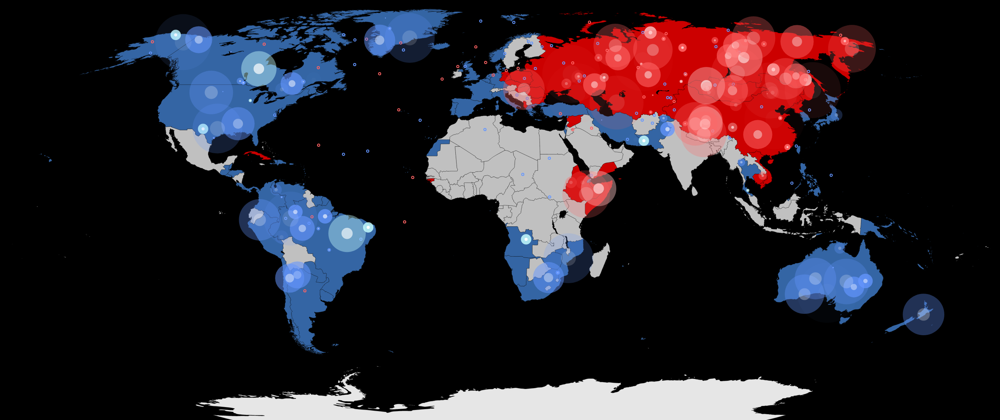
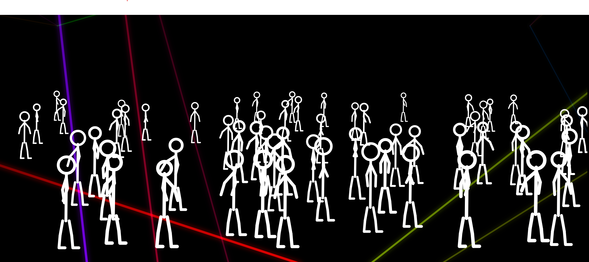

# earhole

Doin' it to ya in ya earhole.

This is a C# WPF application that captures live audio data from the system loopback using WASAPI and visualizes it in real-time using SkiaSharp, creating a dynamic spectrum analyzer with colorful bars.

**Intended Audience**: This project is intended as both a usable audio visualizer and a demonstration of real-time audio processing, rendering, and system integration on Windows.

## Tech Highlights

- **Real-time FFT processing** with 1024-bin resolution at 60 FPS
- **Adaptive beat detection** using multi-band energy analysis, peak detection, and BPM estimation (60-200 BPM)
- **Windows Media Session API integration** for system-wide media control and track info display
- **SkiaSharp hardware-accelerated rendering** with mode-specific optimizations
- **8 unique visualizer modes** including stereo-separated circular visualizers and animated concert crowd simulation

## Features

- Real-time audio spectrum visualization with selectable modes
- **Advanced Beat Detection**: Multi-band analysis system that adapts to song tempo (60-200 BPM) with peak detection, onset flux analysis, and sub-bass frequency targeting for accurate beat tracking across all music genres
- **Now Playing integration**: Displays current track from Spotify and other media players
- Fullscreen mode (press F or F11)
- Graceful exit with farewell message (press Q or Esc)
- Startup message when audio is detected
- Smooth animations and color transitions
- Mode menu (press ` to toggle)

## Prerequisites

- Windows 10/11 (WASAPI is Windows-specific)
  - **Minimum**: Windows 10 version 1809 (build 17763) or later for media integration
- .NET 6.0 Runtime (for running published version) or .NET 6.0 SDK (for building from source)
- Stereo mix/loopback audio device enabled in Windows sound settings (for capturing system audio)

## Architecture

earhole uses a modular, service-oriented architecture for maintainability and separation of concerns:

### Core Services

- **AudioCaptureService**: Manages WASAPI loopback capture, FFT processing, and spectrum data generation
- **BeatDetectionService**: Multi-band energy analysis with adaptive BPM tracking and peak detection
- **ModeManagementService**: Handles visualizer mode switching and shuffle timer
- **UINotificationService**: Manages status messages, animations, and UI text updates
- **KeyboardCommandHandler**: Command pattern for keyboard input handling

### Data Flow

```
System Audio → AudioCaptureService → FFT → Spectrum Data
                                          ↓
                                   BeatDetectionService → Beat Events
                                          ↓
                                      MainWindow → Visualizer Modes
```

The main window acts as a thin coordinator, wiring up services and handling the rendering pipeline. Each service is independently testable and has a single, clear responsibility.

## Libraries Used

- **NAudio**: For WASAPI loopback audio capture
- **MathNet.Numerics**: For FFT (Fast Fourier Transform) calculations
- **SkiaSharp.Views.WPF**: For high-performance 2D graphics rendering in WPF
- **SkiaSharp.Svg & Svg.Skia**: For SVG rendering support (used in Cold War mode)

## Why This Is Interesting

- **Beat detection challenge**: Solved multi-genre beat tracking with 5-part algorithm (sub-band analysis, adaptive thresholding, peak detection, onset flux, BPM-aware cooldown)
- **Performance constraint**: Maintained 60 FPS with real-time FFT processing through optimized spectrum calculations and minimized allocations
- **Framework limitation**: Worked around WPF's lack of trimming support by switching to framework-dependent deployment, reducing size from 150MB to 8MB
- **Cross-app integration**: Implemented smart media session detection that prioritizes music apps and handles Spotify's inconsistent metadata with window title fallback
- **Rendering optimization**: Achieved smooth animations through SkiaSharp GPU acceleration, SVG caching, and object pooling

## Architecture

```
WASAPI Loopback Capture
        ↓
  Float Conversion (Stereo)
        ↓
  FFT (1024-bin resolution)
        ↓
  ┌──────────────────────┐
  │  Beat Detection      │
  │  - Sub-band analysis │
  │  - Peak detection    │
  │  - BPM estimation    │
  └──────────────────────┘
        ↓
  IVisualizerMode Interface
  (Mode-specific rendering)
        ↓
  SkiaSharp Canvas
  (Hardware-accelerated)
        ↓
  WPF UI Layer
  (Input handling + overlays)
```

## Performance Notes

**Target: 60 FPS** - Measured using built-in FPS counter (F3 key). Consistently maintains target across all visualizer modes on modern hardware.

**Key Optimizations:**
- **Cached paint objects**: Reuse SKPaint instances across frames to eliminate allocation overhead in render loops
- **Circular energy buffer**: 3-frame sliding window for peak detection avoids array allocations and enables O(1) lookups
- **SVG render caching**: Cold War mode caches rendered map bitmap at current resolution, only regenerating on window resize
- **Lazy mode initialization**: Visualizer modes defer resource allocation until first render, reducing startup time

## Development Notes

Implementation was accelerated using an AI coding agent; system design, architecture, performance tuning, and validation were directed and verified manually.

## How to Run

### Option 1: Run from Source (Requires .NET SDK)

1. Clone or download the repository
2. Open a terminal in the project directory
3. Run `dotnet run`
4. The application window will open
5. Play audio on your system to see the visualization
6. Use F/F11 for fullscreen, Q/Esc to quit, ` to open the mode menu

### Option 2: Download Pre-built Executable

Pre-built releases are available that require the .NET 6.0 Runtime:

1. **Install .NET 6.0 Runtime** (if not already installed):
   - Download from: https://dotnet.microsoft.com/download/dotnet/6.0
   - Choose ".NET Desktop Runtime 6.0.x" for Windows
2. Go to the [Releases](https://github.com/DigitalMeatbag/earhole/releases) page
3. Download the latest `earhole-v*.zip` file
4. Extract the ZIP file
5. Run `earhole.exe` from the extracted folder

**Note**: The ZIP is ~8MB and includes all necessary files. Keep the exe and assets folder together.

## Controls

- **F** or **F11**: Toggle fullscreen mode
- **Q** or **Esc**: Quit the application
- **`** (backtick): Toggle mode menu to switch visualizers
- **Space**: Pause/play currently playing media
- **I**: Toggle between temporary (default) and persistent track info display
- **F3**: Toggle FPS counter display
- **0-8**: Quick switch to visualizer modes:
  - **0**: Shuffle mode
  - **1**: Spectrum Bars
  - **2**: Particles
  - **3**: Circle
  - **4**: Two Circles
  - **5**: Fairies
  - **6**: Wave
  - **7**: Cold War
  - **8**: Dance
- **Window Close Button**: Normal window close

**Note**: Number keys work with both the top row and numpad.

## Now Playing Integration

earhole automatically detects and displays track information from media players running on your system:

- **Supported Players**: Works with Spotify, iTunes, MusicBee, VLC, web browsers, and other media apps using Windows Media Session API
- **Smart Detection**: Automatically prioritizes music players over video editors and other non-music apps
- **Spotify Fallback**: If Spotify doesn't expose metadata via the Windows API, earhole automatically reads the window title as a fallback
- **Display Modes**:
  - **Temporary (default)**: Track info fades in when a song starts, displays for 3 seconds, then fades out
  - **Persistent**: Press **I** to toggle; track info remains visible continuously in the top-left corner
- **Automatic Updates**: Track info updates automatically when songs change

**Note**: Track detection works best when only one media player is active. If multiple apps are playing media (e.g., Spotify and a video editor), close or pause non-music apps for best results.

## Visualization Modes

- **🔀 Shuffle** (default): Automatically cycles through all visualizer modes every 30 seconds with true randomization; never shows the same mode twice in a row. Perfect for variety during long listening sessions. Press **0** again while in shuffle mode to manually skip to a new random mode.
- **📊 Spectrum Bars**: 1024-bin spectrum analyzer with ROYGBIV coloring; bars scale with volume and frequency content.
	- 
- **✨ Particles**: Audio-reactive particle field launched from the bottom; color and velocity respond to frequency/intensity.
	- 
- **⭕ The Circle**: Circular spectrum visualizer where frequencies ripple outward from center; segments are colored red (expanding), white (stable), or blue (contracting) based on velocity.
	- 
- **♾️ Two Circles**: Dual circular visualizers displaying true stereo separation with continuous color cycling. Left channel (left circle, clockwise) and right channel (right circle, counter-clockwise) each use two dynamically cycling colors: one for expansion and one for contraction. The four colors (left outward, left inward, right outward, right inward) are always distinct, cycling through the full HSV spectrum at 90-degree offsets to maintain maximum separation. White indicates stable/neutral state. Beat detection triggers both circles to compress inward and spawn compression waves that propagate toward the centers while fading out. Each wave's color is calculated as the intensity-weighted average of its parent circle's spectrum at the moment of the beat, creating a visual representation of which frequencies are most active. The mirrored rotation directions (left clockwise, right counter-clockwise) create a symmetrical visual effect that emphasizes stereo imaging and phase relationships through additive segment blending.
	- 
- **🧚 Fairies**: Seven ROYGBIV fairies fly organically across the screen, each tracking a dynamic frequency range; glow intensity reflects audio activity, speed and movement erraticism increase with rising intensity.
	- 
- **🌊 The Wave**: Dual-channel waveform visualizer with stereo separation; right channel (red) displays upward, left channel (blue) displays downward. Beat detection triggers color change to white and spawns colorful glowing particles at random positions.
	- 
- **💥 Cold War**: Interactive geopolitical visualizer displaying an authentic 1980s world map with Soviet (red) and Western (blue) alliance territories. Audio spectrum samples trigger territorial events: left channel dominance creates small defensive explosions, while right channel dominance launches arcing missiles toward opposing territories with large impact explosions. Beat detection doubles explosion brightness for dramatic sync with the music's rhythm.
	- 
- **🕺 The Dance**: Concert crowd simulation with 40-80 animated stick figure dancers positioned in perspective depth. Features include: independent limb movement and physical variation per dancer (height, proportions), randomized animation timing for natural crowd motion, intensity-triggered lighter raising (5% probability, 30s cooldown, 4-6s duration with random flame colors), 12 audio-reactive lasers (6 stage lasers sweep outward, 6 ceiling lasers sweep inward with color cycling), beat-synchronized crowd jump ripple that propagates from stage to back, and subtle screen flash effects on beats. Each dancer responds to different frequency bands creating a dynamic concert atmosphere.
	- 

All modes update in real time. Switch modes using:
- **Backtick (`)**: Open visual mode menu
- **Number keys (0-8)**: Instantly switch to specific modes (see Controls section above)

When you select shuffle mode, it resumes automatic cycling. When you select a specific mode, it stays on that mode until you change it.

## Building from Source

If you want to modify the code:

1. Install .NET 6.0 SDK
2. Run `dotnet build` to compile
3. Run `dotnet run` to test
4. To create your own published version: `dotnet publish earhole.csproj -c Release -r win-x64 --no-self-contained -o publish`

### Automated Release Build

For convenience, use the included PowerShell script to automate the entire release process:

```powershell
.\build-release.ps1
```

This script will:
- Clean the publish directory
- Build the project in Release mode
- Publish as a framework-dependent executable (requires .NET 6.0 Runtime)
- Create a timestamped ZIP archive (e.g., `earhole-v2025-12-29.zip`)

The ZIP contains the executable, necessary DLLs, and the assets folder. Distribute the ZIP as-is; users should extract and run `earhole.exe` from the extracted folder (do not move the exe or assets out of that folder).

## Troubleshooting

- **No visualization**: Ensure stereo mix/loopback is enabled in Windows Sound settings
- **Audio not detected**: Check that applications are playing audio through the system
- **Performance issues**: The app uses FFT on audio samples; ensure your system can handle real-time processing

## License

See LICENSE file for details.